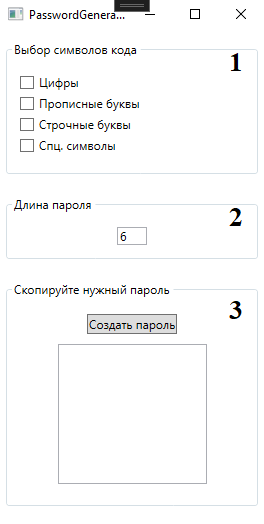

# PasswordGenerator

Проект который навеян безопасностью приложений, работы и сохрания Google всей информации о фользователях в том числе и данных которые относятся к безопасности.
Данное приложение позволяет формировать на рабочем компьютере безопасный пароль для регистрации и зменения пароелей от уже имеющихся учётных записей.
Скачать прилодние можно [здесь](https://disk.yandex.ru/d/geXwgyvVsjkElA)

##Работа приложения

1. Поле выбора символов внутри приложения
2. Установка длины пароля в приложении
3. Окно сгенерированных паролей

Для того что бы программа генерировала код надо выбрать символы которые будут участвовать в формировнии кода п.1, задать длину п.2, нажать кнопку Создать пароль.
Программа сконструирована таким образом, что генерирует 7 паролей случайным образом для конеченого использования.

